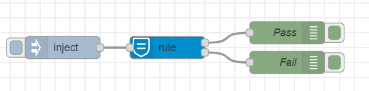
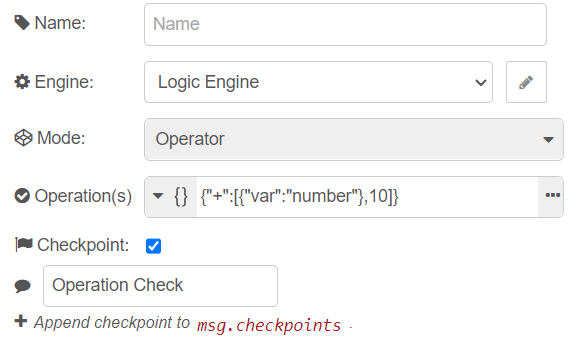

# node-red-contrib-json-logic
This is a Node-RED node for creating [JsonLogic](#https://jsonlogic.com/) in your flow.

## Installation :zap:
To install the node execute the following command inside the `.node-red` directory:
```console
npm install node-red-contrib-json-rule
```

## Logic Node :vulcan_salute:
The `logic` node utilizes the [json-logic-engine](#https://jessemitchell.me/json-logic-engine/) which makes it easy to write safe instructions for evaluating and operating on `json` data. These instructions can be persisted into a database, and shared between the front-end and back-end. This works very similarl to having an *access control list* for the data traversing through your flow, if the node is set to [`rule mode`](#rule), or applying custom logic to your json data, if the node is set to [`operator mode`](#rule).

## Using the Logic Node :wrench:
The logic node has two modes:
- #### Rule
  This mode is used to apply a rule on the data given, the node evaluates the rule against the `msg.payload` and forwards the `msg` object accordingly to the `pass` and `stop` outputs. Rules defined must be *logical operations* and in *json* format:

  
  [Here you can find the rule flow shown above.](./docs/rule_node_flow.json)

  Check [here](#https://jessemitchell.me/json-logic-engine/docs/logic) for more info on **logical operations**

- #### Operator
  This mode is used to perform custom logic operations on the fly when a  `msg.payload` is inbound, the node evaluates the operation and adds it to the `msg.operation` field.

  
  [Here you can find the operator shown flow above.](./docs/operator_node_flow.json)

  
  Check [here](https://jessemitchell.me/json-logic-engine/docs/math) for more info on **math operations**

## Setting the Rules :bookmark_tabs:
The rules used by the logic node must be in `JSON` format and they can be set by editing the `Rule(s)` property on the logic node's edit dialog window. There is also an option to set the rules using a `msg` field by clicking on the dropdown next to the node's property and selecting `msg`.   
    
  

Same is true for when using the logic node in the `operator` mode. The `Rule(s)` property transforms to `Operation(s)` property and a **non** logical operation is expected in the input field 
  
  

  ## Check please? :receipt:
  In the edit dialog of the logic node there is a property called `Checkpoint`, the button next to it can be clicked to set the node to append information to the `msg.check` field about the logic rule or operation used, the result, the node's id and a timestamp of the event. 

  ### Rule Mode output with Checkpoint set to "`Append Check`":  
  ```json
  {
    "_msgid":"c8a5c57cb82e2998",
    "result":35,
    "payload":{
      "number":100,
      "string":"World",
      "object":{
        "first":{
          "value":25  
      }}},
    "check":[
      {
        "id":"6b0d189cd32a9105",
        "rule":{
          "+":[
            10,
            {"var":"object.first.second.value"}
          ]
        },
        "result":35,
        "timestamp":"Fri May 26 2023 18:00:00 GMT+0300 (Eastern European Summer Time)"
      }
    ]
  }
  ```